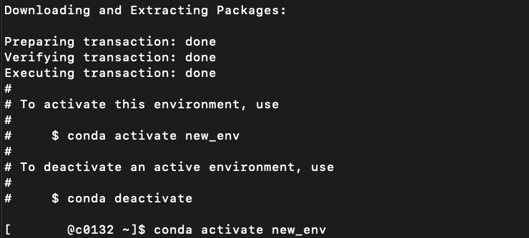
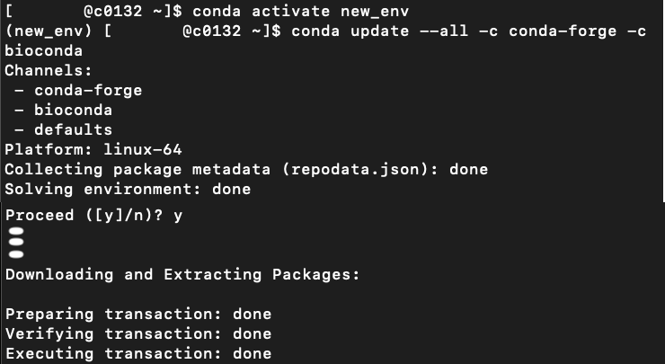
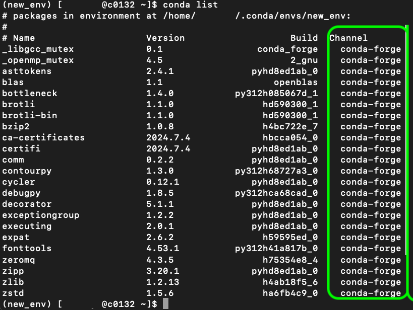
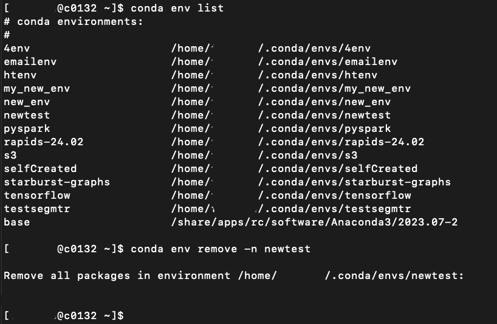

# Migrating Conda Environments using Miniforge

This tutorial will guide you through the steps necessary for migrating Conda environments originally installed with the `default`, `anaconda` or `r` channels to use the Miniforge module and the `conda-forge` or `bioconda` channels.

## Access to Terminal

Access the terminal on Cheaha. You can access the terminal for a compute node on Cheaha, after creating an interactive job. Click on the highlighted part of the image below to access the terminal.


## Steps for Migrating your Conda Environment

1. **Load Anaconda Module**
You will need to load the Anaconda module using the `module load Anaconda3` command, in a terminal.

1. **Activate the Original Conda Environment**
Activate the environment you want to migrate:

```bash
conda activate <your_old_environment>

```

Replace `<your_old_environment>` with the name of your existing Conda environment. In this tutorial the environment `newtest` will be used as an example.

```bash
conda activate newtest

```

   

1. **Export the Environment to a .txt File:**
Export the environment to a `.txt` file, which captures the list of installed packages and their versions:

   ```bash
   conda list --export > <filename.txt>

   ```

Name the file as you see fit.

   ```bash
   conda list --export > migrate_env.txt

   ```

When the file has been created, deactivate your Anaconda environment, and do a module reset using the `conda deactivate` and `module reset` commands respectively.

1. **Load the Miniforge Module**
The next step is to load the Miniforge module on Cheaha using the `module load Miniforge3` command.

1. **Create a New Conda Environment:**

By default Miniforge creates a new environment using the `conda-forge` channel, but for this example we specifically include the option to use the conda-forge and bioconda channels:

   ```bash
   conda create -n <new_environment_name> --file <environment_backup.txt> -c conda-forge -c bioconda

   ```

Replace `<new_environment_name>` with your desired new environment name. This command will read from the `environment_backup.txt` file and install the packages from the specified channels like `conda-forge` and `bioconda` channels.

   ```bash
   conda create -n new_env --file migrate_env.txt -c conda-forge -c bioconda

   ```


After completing the above steps we will now need to update the environment using the Conda-Forge or Bioconda channels.



1. **Activate the New Environment:**
Activate the new environment you created:

   ```bash
   conda activate <new_environment_name>

   ```

1. **Update All Packages to Use the Conda-Forge Channel:**

Update all packages in the environment to ensure they are installed from the `conda-forge` or `bioconda` channels:

   ```bash
   conda update --all -c conda-forge -c bioconda

   ```

   

Now we have created the environment and updated the packages inside the environment, we can verify packages within our environment by following the below steps.

1. **Check Installed Packages:**
Verify that all packages have been correctly installed using the `conda-forge` or `bioconda` channels:

   ```bash
   conda list

   ```

Look at the "channel" column to ensure most packages are from `conda-forge` or `bioconda`.



1. **Test the New Environment:**

Run your scripts or workflows that depend on this environment to confirm that everything functions as expected. You may then decide to remove your old environments to free up space.

1. **Remove the Old Environment:**

If everything works correctly with your new environment, you can remove the old environment:

   ```bash
   conda env remove -n <your_old_environment>

   ```

You may or may not switch modules to delete the environment, but we advise you switch modules to delete environments created with the Anaconda module.

   ```bash
   conda env remove -n newtest

   ```

   
