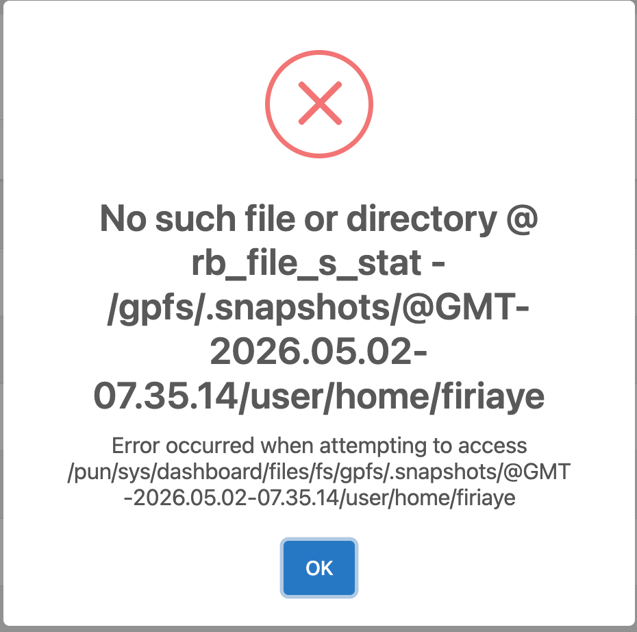

# Access GPFS Snapshots on Cheaha

GPFS snapshots on Cheaha allow you to recover deleted or modified files without needing to contact support. These snapshots function similarly to tools like Time Machine on macOS or Timeshift on Linux, but are accessed directly through the filesystem.

## Overview

Snapshots are **read-only, point-in-time copies** of your project directory that are created automatically.

- Snapshots are created **daily** at a particular time
- Approximately **14 days of history** are retained
- Snapshots are a **self-service recovery mechanism**
- Snapshots are located in a **hidden directory** within the `/gpfs` directory for your user files stored in `/data/user/$USER`
- They are located at `/data/project/<Project-Directory-Name>/.snapshots` within your project directory
- Files are restored by **copying them out of the snapshot**. Use the `cp` command

<!-- markdownlint-disable MD046 -->
!!! note
    Snapshots provide short-term recovery only. For long-term backups, condsider using [Long Term Storage (LTS)](../lts/index.md).
<!-- markdownlint-disable MD046 -->

## Accessing Snapshots via the Terminal

### Open a Terminal

Access a terminal using one of the following methods:

- Launch an HPC Desktop session through [Open OnDemand](../../../cheaha/open_ondemand/hpc_desktop.md#accessing-the-terminal)
- [Connect via SSH to Cheaha](../../../cheaha/getting_started.md#accessing-cheaha)

### Navigating to Your Project or User Snapshot Directory

Snapshots are available for your user directory files (i.e. `/data/user/$USER`), and project directory files. These files are located in different locations. To access your project directory files, please change directory into your project directory:

```bash
cd /data/project/<project_directory>
```

To access files from your data user directory, you will need to change directory into the `/gpfs` directory.

```bash
cd /gpfs/
```

### Accessing the Snapshot Directory

For both locations, snapshots are stored in a hidden directory named `.snapshots`. You can list the directories in your project or user directory by running the `ls -a` command if you are already within the project or `/gpfs/` directory, or by using the absolute path to the respective directory.

```bash
ls -a /data/project/<project_directory>/
```

For a user directory, you will run

```bash
ls -a /gpfs/
```

You should see a `.snapshots` directory listed. To access the snapshots located in your project directory, run the command.

```bash
cd /data/project/<project_directory>/.snapshots/
```

To access your user directory run the command

```bash
cd /gpfs/.snapshots/
```

<!-- markdownlint-disable MD046 -->
!!! note
    Only files available in your `/data/user/$USER` directory, are saved in the snapshot directory located in `/gpfs` for users to retrieve.
<!-- markdownlint-disable MD046 -->

### List Available Snapshots

You can view all available snapshots in the `.snapshots` directory with the `ls` command. You should see a number of directories, with timestamps showing the exact time those files were saved.

```bash
ls
```


<!-- markdownlint-disable MD046 -->
!!! tip
    Choose a snapshot created before the file was deleted or modified.
<!-- markdownlint-disable MD046 -->

### Enter a Snapshot Directory

Navigate into a snapshot directory, and note the date format. The files in the directory are named in the format "@GMT-YYYY.MM.DD-07.35.14". All snapshot directories are saved at **7.35.14 GMT**, so all directories listed here, will have that timestamp suffix.

```bash
cd @GMT-YYYY.MM.DD-07.35.14
```

For instance, if you need to access files in your project directory from April 23, 2026, those files can be accessed by running the command.

```bash
cd @GMT-2026.04.23-07.35.14
```

To access files located in your user directory snapshot, you will run the command.

```bash
cd @GMT-2026.04.23-07.35.14/user/$USER/
```

Make sure the date you enter falls within the 14 day period, and is listed as one of the files in the snapshot directory.

### Locate Your File

Browse the snapshot as if it were your normal project or user directory. So commands for file navigation like `ls` and `cd` will come in handy. You can review our [Using the Terminal](../../../cheaha/open_ondemand/hpc_desktop.md#using-the-terminal) section for additional information.

```bash
ls

cd <path/to/files/in/snapshot/directory>
```

### Restore the File

Copy the file from the snapshot back to your project directory using the `cp` command:

```bash
cp <source> <destination>

cp /data/project/.snapshots/directoryORfilename /path/to/restore/
```

Or in the case of your user directory.

```bash
cp filename /gpfs/.snapshots/directoryORfilename /path/to/restore
```

[ Screenshot: Copy command restoring file, navigating snapshots directory]

<!-- markdownlint-disable MD046 -->
!!! important
    Snapshots are **read-only**. Files must be copied out to be restored, before they can be used.
<!-- markdownlint-disable MD046 -->

## Accessing Snapshots via Open OnDemand (OOD)

At this time, you can only access your snapshots via the Terminal, trying to access the snapshots via OOD will return an error.



## Common Mistakes

Avoid the following:

- Attempting to modify files inside `.snapshots` directory
- Selecting a snapshot created **after** the file was deleted
- Using an incorrect directory path
- Attempting to restore Ceph-stubbed files directly

## When to Contact Support

Contact Research Computing if:

- You receive an **"Operation not permitted"** error
- The file is not present in any snapshot
- You are unsure whether your data is GPFS or Ceph-resident
- You need help restoring large or complex datasets

For critical data that needs to be archived, consider using [Long Term Storage (LTS)](../lts/index.md), as snapshots are not intended for use as an archive.

If you need assistance, please [contact us](../../../index.md#how-to-contact-us).
